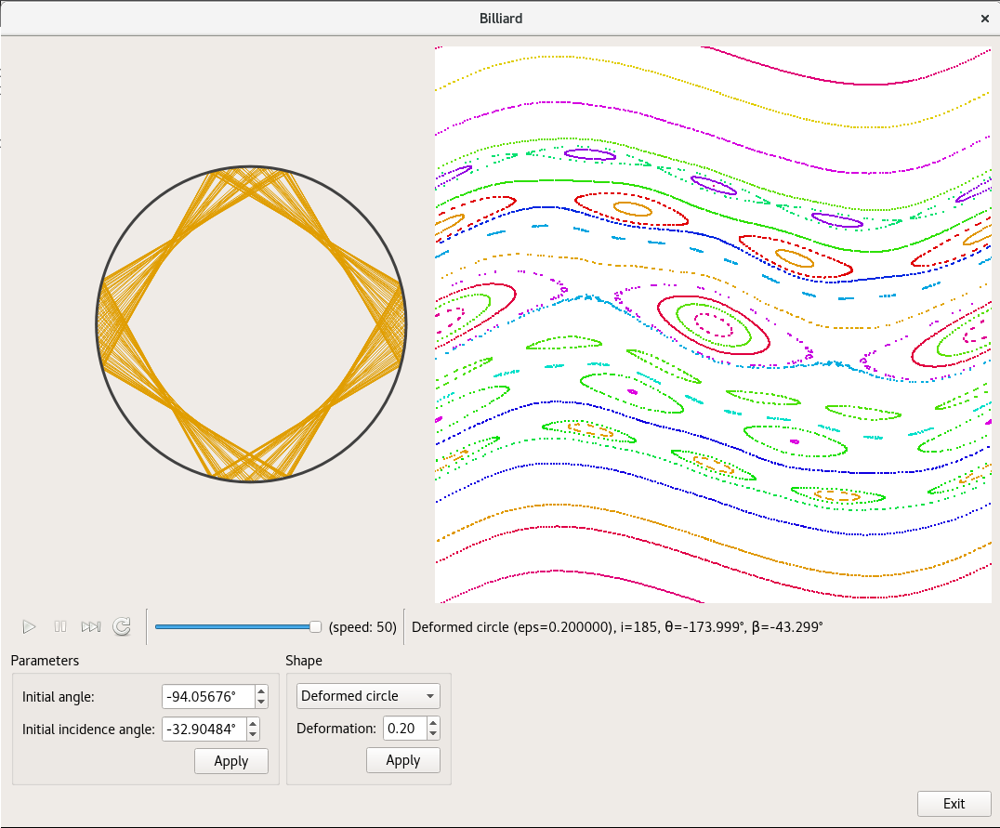

# ChaoticBilliard

The purpose of this program is to compute the dynamics of chaotic billiards
and display the trajectories both in physical space and phase space.

Currently, three types of billiards are supported:
- Circular billiard (not chaotic)
- Elliptic billiard
- Deformed circular billiard with shape `r(theta) = 1 + e*cos(theta)`

Above is a screenshot for a deformed circular billiard. On the left is
drawn the billiard and one trajectory. On the right, one can see the phase
space: the horizontal axis corresponds to the angle on the billiard
(between -180° and 180°), the vertical axis corresponds to the angle of
incidence (between -90° and 90°). Different colors correspond to different
trajectories.

## Dependancies and compilation
The graphical display uses [Qt 5](http://doc.qt.io/qt-5/). 
See [here](http://doc.qt.io/qt-5/gettingstarted.html) for information
on how to install Qt.

Once Qt is installed, the program can be compiled with the command-line:
`qmake && make`.
The executable is called `Billiard`.

The compilation was only tested on Linux but should work as well with
MacOS and Windows. Currently no binaries are provided.

## User interface
The user interface should be intuitive. The shape of the billiard can be
changed using the 'Shape' toolbox. The initial parameters can be changed
using the 'Parameters' toolbox, or, more interestingly, by clicking on the
drawing of the phase space. The buttons in the toolbox are, from left to
right, *play* (run automatic evolution of the system), *pause*
(pause the evolution), *forward* (do only one step), *reinit* (reinitialize
both the shape and the parameters) and *speed*
(speed of the automatic evolution in FPS).

## License

This software is licensed under
[GNU GPL 3](https://www.gnu.org/licenses/gpl-3.0.html).
You are very welcome to contribute to it!

Qt is licensed under [GNU LGPL](http://doc.qt.io/qt-5/licensing.html).
